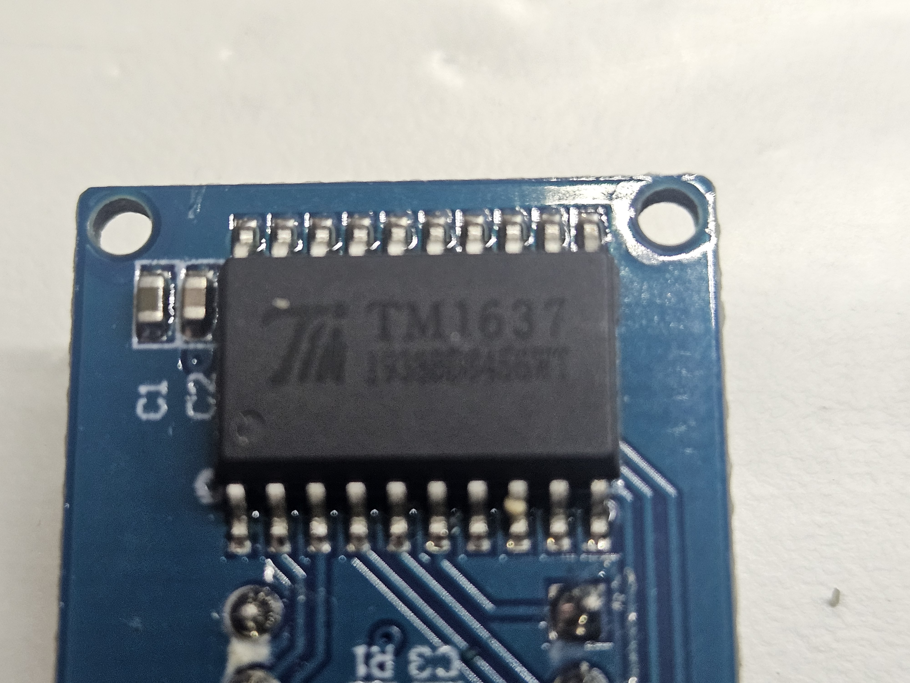
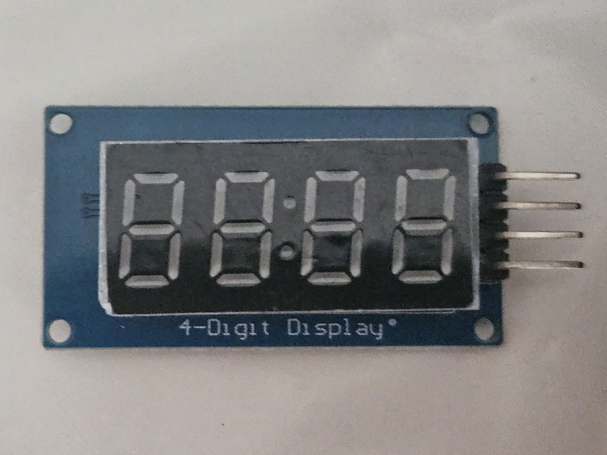
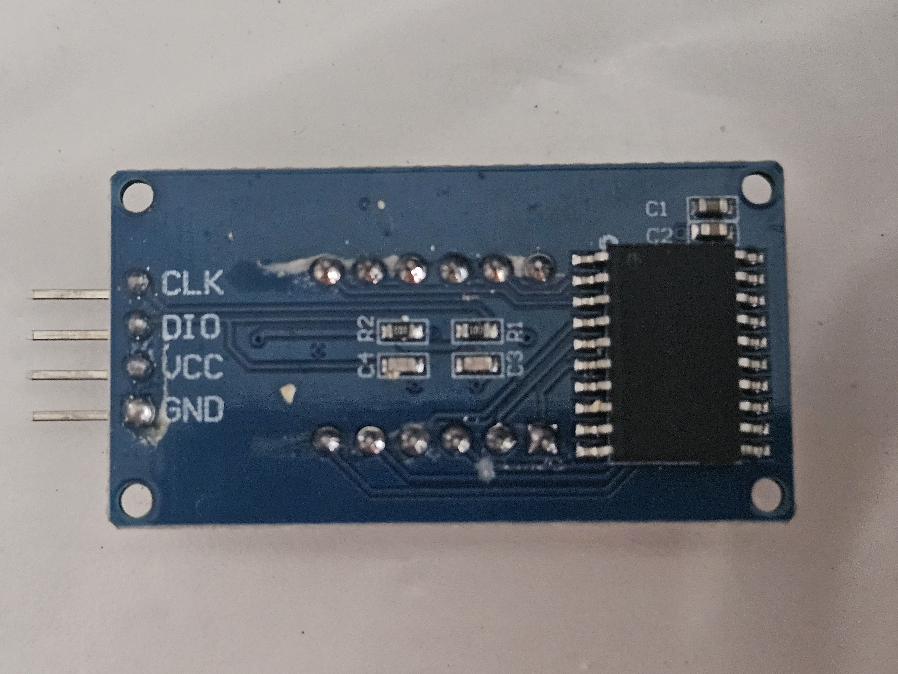
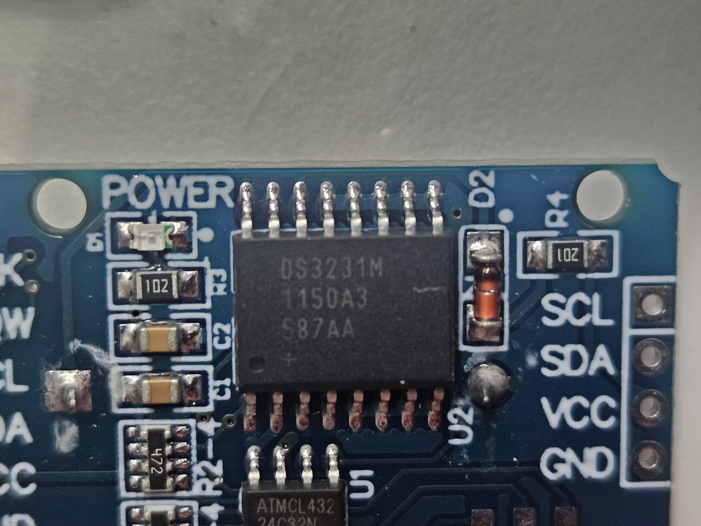
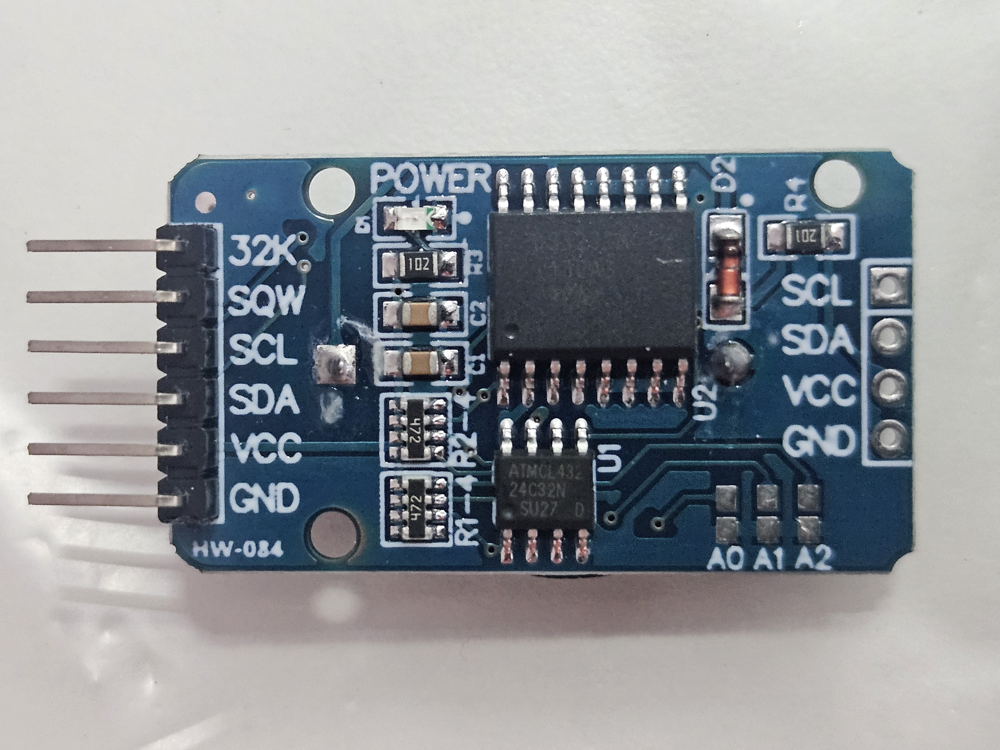

ATtiny85_tokei_project

このプロジェクトは日本語で、主に日本のユーザーに向けて発信しています。

マイコンはATtiny85を使って、DS3231クロックモジュールで時間管理をして、TM1637 7セグ4桁LEDモジュールを使って遅刻表示をします。入力ボタンを一個使用して、時刻セットなどを行います。

2025年8月21日の開発状況は、ボタン入力時のチャタリング忘止のアルゴリズムの検証と、確認作業を行いました。
2025年8月23日チャタリング対策の別のアルゴリズムを考案（合計3）

ボタン入力のチャタリング対策について

（第一案）ボタン入力のチャタリング対策のアルゴリズムを独自に開発して実装しました。一般的に用いられているタイマーを使ってのチャタリング回避や、安定しないチャタリングのバウンドのカウントなどを行わず、マイコンの数サイクル家内にボタン押下状態を確定します。非常に単純なアルゴリズムで動作しますので、動作環境を選ばずに動作します。（動作検証済み。実用可能）

（第2案）ハード上での対策で、アナログ入力によるチャタリング防止です。副次的な相乗効果として、入力ボタンの多重化が出来る予想できます。ノイズの問題がなければ、応用が利くとても有望な理論です。（理論が完成、まだ未検証）

（第3案）1クロックでボタンの状況を確定するアルゴリズムで、遅延がマイコンの限界速度なのでゲームの入力などにとても有利になる可能性があります。（理論が完成、まだ未検証）

TM1637 チップ拡大

TM1637 表面

TM1637 裏面

DS3231 チップ拡大

DS3231 表面

